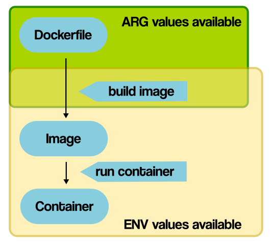

## ARG（构建参数）

- ARG 指令用于定义构建参数，这些参数在构建镜像时传递给 Docker Daemon。它们只在构建过程中存在，并且不会保存在最终的镜像中。
- 构建参数可用于在构建过程中动态地设置一些值，例如软件版本号、下载地址等，从而使镜像的构建更灵活和可配置。
- 构建参数可以通过 --build-arg 标志传递给 docker build 命令，并且可以在 Dockerfile 内部通过 ${参数名} 的形式进行引用。

示例：
```
ARG BASE_IMAGE=ubuntu:latest
FROM $BASE_IMAGE
```
```
docker build --build-arg BASE_IMAGE=alpine:latest .
```

## ENV（环境变量）

- ENV 指令用于设置环境变量，这些变量在容器运行时可用，并且会存在于最终的镜像中。
- 环境变量在容器内部可以被应用程序使用，也可以在 Dockerfile 内部的后续步骤中引用。
- ENV 指令也可以用于设置默认值，但这些值可以在运行容器时通过 -e 选项或者 Docker Compose 文件中的 environment 部分进行覆盖。

示例：
```
ENV APP_HOME=/app
WORKDIR $APP_HOME
```
```
docker run -e ENV_VARIABLE=value my_image
```

ARG 适用于构建过程中的临时值，而 ENV 则用于设置容器运行时的环境变量。使用它们可以使 Dockerfile 更具灵活性和可配置性。
